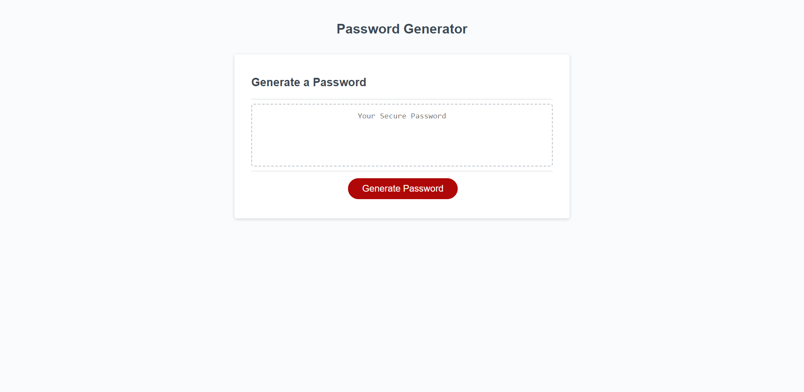

# 03 Password Generator

## Description

This repo contains a password generator. I was given the HTML, CSS, and JavaScript files. I was tasked with creating a password generator that would meet certain criteria, including character length and type of characters (all within window prompts), and then produce a password that met the criteria. If this criteria wasn't met, there is a window that alerts the user that the criteria wasn't met. 

Here is the link to the page:
https://michaelayers3.github.io/Password-Generator/

## Installation

N/A

## Usage

The user is prompted to enter a password length between 8 and 128 characters. If the user enters a number outside of this range, they are alerted that the number is not within the range. If the user enters a number within the range, they are prompted to choose whether or not they want to include lowercase letters, uppercase letters, numbers, and/or special characters. If the user chooses to include at least one of these, they are given a password that meets the criteria. If the user chooses not to include any of these, they are alerted that they must choose at least one of these.

## Credits

University of Utah
EdX
Jonathan Bejarano

## License

Please refer to the LICENSE in the repo.
